# Tugas Praktikum
1. Jelaskan perbedaan Spark Streaming dengan metode stateless dan stateful stream processing?
2. Jelaskan masing-masing maksud kode berikut sesuai nomor kodenya pada laporan praktikum Anda!

## Praktik Dasar Spark Streaming

| Metode 1: Mode Stateless Stream Processing | |
|---|---|
| Interval waktu per 1 detik | Interval waktu per 5 detik |
| 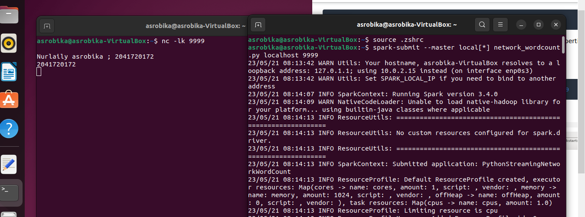 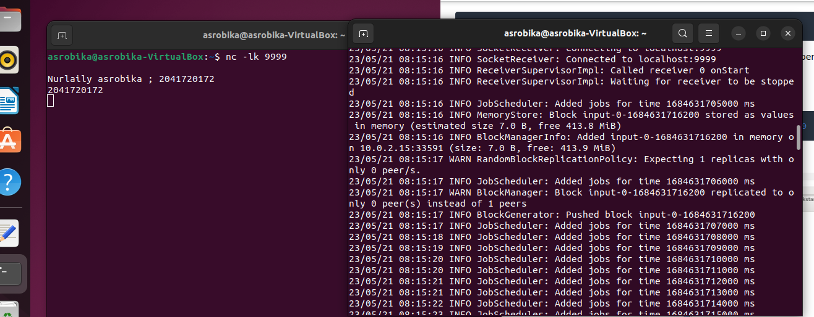 | 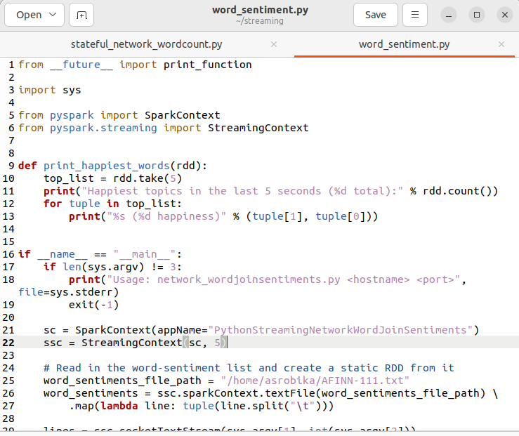 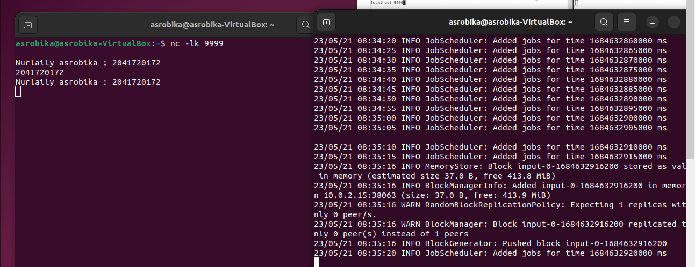  |

| Metode 2: Mode Stateful Stream Processing | |
|---|---|
| Interval waktu per 1 detik | Interval waktu per 5 detik |
| 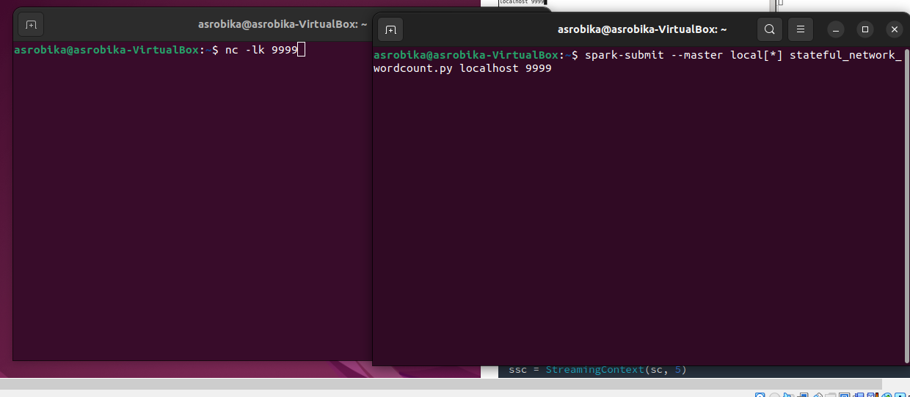 | 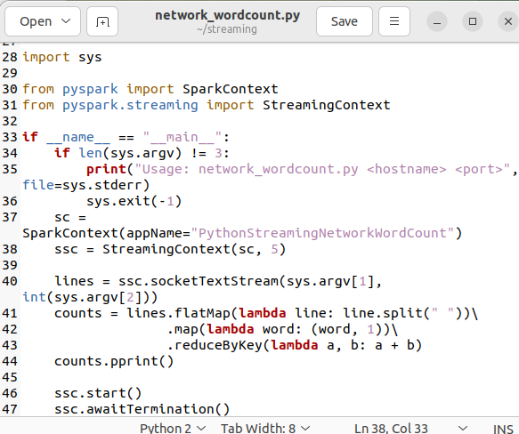 |
| 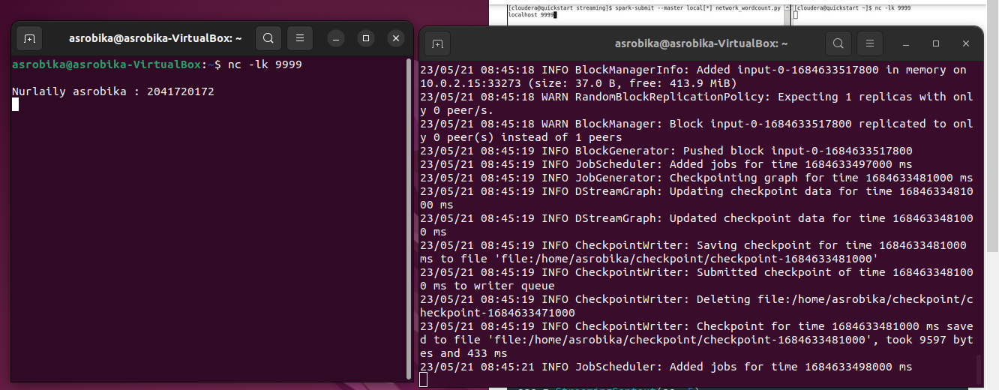 | 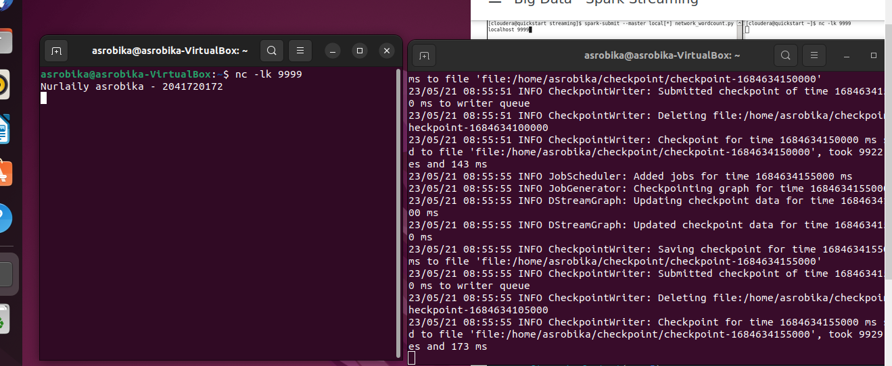 |
| 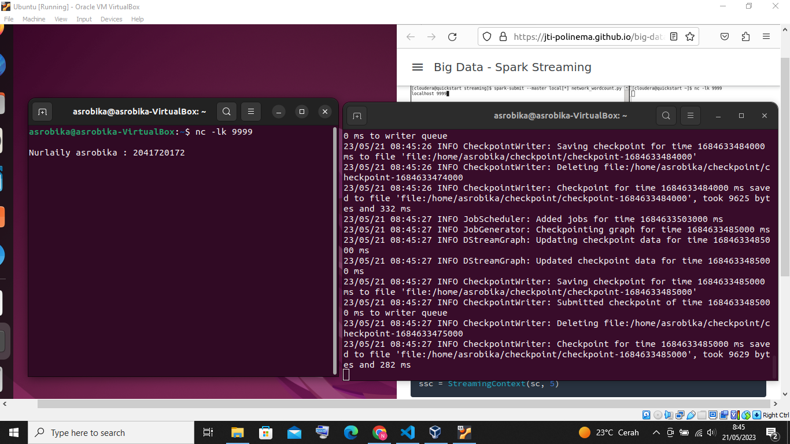 | |

## Melakukan Transformasi di Spark Streaming

| Interval waktu per 1 detik | Interval waktu per 5 detik |
|---|---|
| 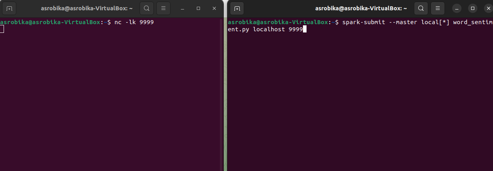 | 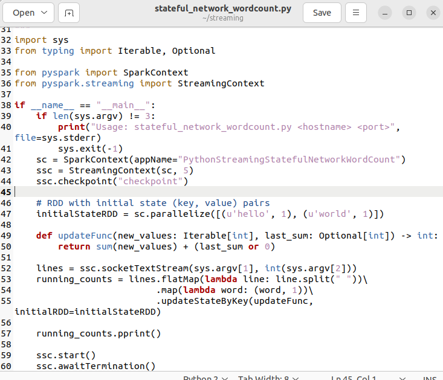 |
| 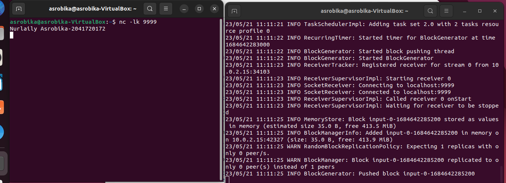 | 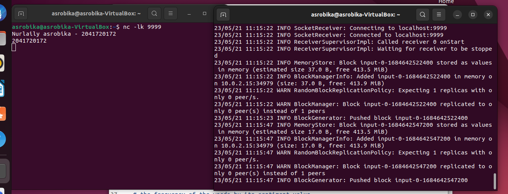 |
